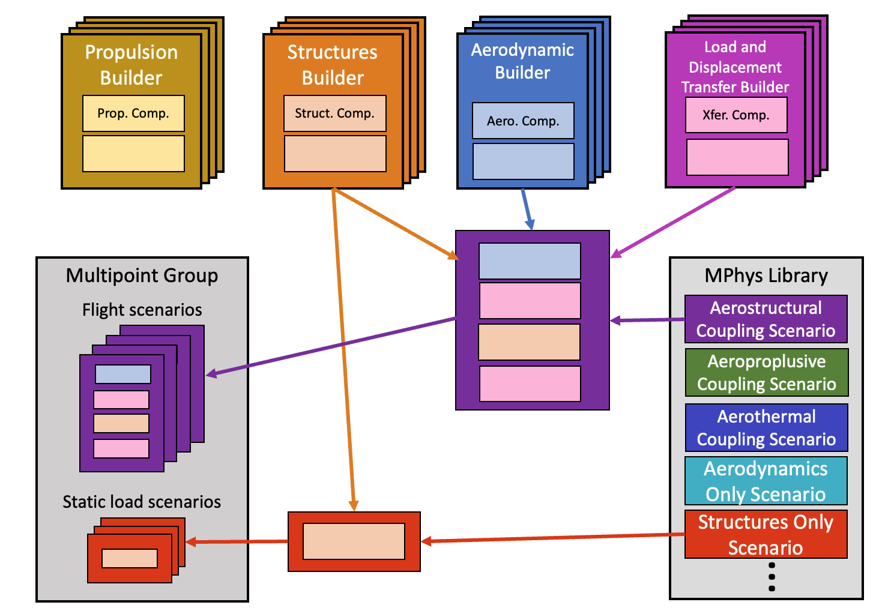

.. _model_assembly:

=========================
Assembling an MPhys Model
=========================

MPhys tries to automate most of its model assembly process using the builder software design pattern.
If using a :class:`MultipointParallel <mphys.MultipointParallel>` group,
skip steps 3-4 as these are handled within the Scenario since each Scenario will have its own MPI communicator.

.. code-block:: python

	import openmdao.api as om
	from mphys import Multipoint, MPhysVariables
	from mphys.scenarios import  ScenarioAerodynamic

	from my_aero_code import AeroBuilder

	# Step 1
	class MyMPhysModel(Multipoint):
	    def setup(self):

	        dvs = self.add_subsystem('dvs', om.IndepVarComp())
	        dvs.add_output('aoa', val=0.0, units='deg')

	        # Step 2
	        aero_builder = AeroBuilder(mesh="naca0012.ugrid")

	        # Step 3
	        aero_builder.initialize(self.comm)

	        # Step 4
	        self.add_subsystem("aero_mesh", aero_builder.get_mesh_coordinate_subsystem())

	        # Step 5
	        scenario = ScenarioAerodynamic(aero_builder=aero_builder)

	        # Step 6
	        self.mphys_add_scenario("cruise", scenario)

	        # Step 7
	        self.connect("dvs.aoa", "cruise.aoa")
	        self.connect(MPhysVariables.Aerodynamics.Mesh.COORDINATES,
	                     MPhysVariables.Aerodynamics.Surface.COORDINATES)

1. Define an :class:`Multipoint <mphys.Multipoint>` group.
2. In the ``setup()`` method of the Multipoint group, instantiate
   the :ref:`Builder <builders>` associated with the disciplinary solvers you intend to use.
3. Initialize the disciplinary Builders with the MPI communicator of the Multipoint group.
   This should be done in the ``setup()`` method of the Multipoint group after the builder is instantiated.
   For example, ``aero_builder.initialize(self.comm)``
4. If applicable to the discipline, add a subsystem for the initial mesh coordinates from the builder's :func:`get_mesh_coordinate_subsystem <mphys.Builder.get_mesh_coordinate_subsystem>` function.
   This subsystem allows the disciplinary solver to dictate the parallel decomposition of its mesh.
   Any geometry manipulation subsystems, data transfer scheme subsystems, etc. will then be connected to the mesh subsystem's mesh coordinate output.
5. Create an MPhys scenario from the :ref:`scenario_library`.
6. Use :func:`mphys_add_scenario <mphys.Multipoint.mphys_add_scenario>` to add the scenario to the Multipoint group.
   Add customized coupled nonlinear and linear solvers to the scenario in this function call.
7. Connect inputs to the scenarios. Since MPhys uses :ref:`tagged_promotion`,
   these inputs will have been promoted to ``{scenario_name}.{variable_name}``.
   Typically the inputs that need to be connected are the design variables of the disciplinary solvers
   and mesh coordinates (if applicable to the discipline).
   These mesh coordinates may come from the initial mesh, or be altered by a geometry tool.
8. Repeat steps 5-7 until your Multipoint group is fully defined.

--------
Examples
--------

- The `supersonic panel example <https://github.com/OpenMDAO/mphys/blob/main/examples/aerostructural/supersonic_panel/run.py>`_ provides an example of this model assemble and usage in a self-contained problem (no external disciplinary solvers).
- The `oas_tacs_wing example <https://github.com/OpenMDAO/mphys/blob/main/examples/aerostructural/oas_tacs_wing/run_oas_tacs_wing.py>`_ is another relatively simple example case that uses open-source disciplinary solvers.
