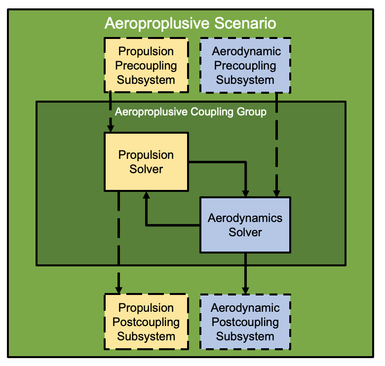
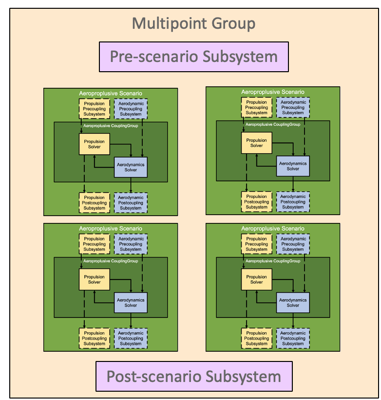

===============
Model Hierarchy
===============

MPhys uses a hierarchical set of OpenMDAO groups to build multiphysics models.
Each level of the hierarchy is a different OpenMDAO group that MPhys provides.

The highest level of the model is the multipoint group.
The multipoint group consists of scenarios which represent different conditions and/or types of multiphysics analyses to be performed.
Within the scenario is the coupling group which represents the primary multiphysics problem for the scenario.

See :ref:`model_assembly` for information an out to create this model heirarchy for a particular problem.

:ref:`builders` are used to help populate these levels of the model hierarchy with subsystems from the solvers.
:ref:`tagged_promotion` is used to promote specific variables to the level of scenario.

.. _coupling_groups:

---------------
Coupling Groups
---------------

The CouplingGroup is the primary physics coupling being solved.
That is, it contains physics modules, such as an aerodynamic or structural solver,
and potentially modules that transfer or interpolate between the physics modules, such as a load or displacement transfer scheme.

Each type of scenario typically has an associated coupling group that it will add automatically given the proper builders.
Within the Scenario group, the coupling group will have the name 'coupling'.
The scenario-specific coupling group will have a default nonlinear and linear solvers,
but these can be overwritten with the optional arguments to :func:`~mphys.Multipoint.mphys_add_scenario`.

.. _scenario_groups:

---------------
Scenario Groups
---------------
The scenario level is an OpenMDAO group that represents a specific condition in a multipoint optimization.
For example, a scenario could be a cruise flight condition that requires a coupling group to determine the lift and drag.
The scenario group contains a coupling group and any scenario-specific computation that needs to occur before or after the associated coupled problem is solved.
The subsystems before the coupled problem are referred to as 'pre_coupling' subsystems.
The subsystems after the coupled problem are referred to as 'post_coupling' subsystems.
An example post_coupling subsystem would be a sonic boom propagation analysis after an aeropropulsive coupling analysis.

MPhys provides a library of these Scenario groups designed for specific type problems.
See :ref:`scenario_library` for details about specific standardized scenarios.
If a particular multiphysics problem is not covered by the MPhys library, new scenarios and coupling groups can be created by subclassing the :class:`~mphys.MPhysGroup`.

-----------------
Multipoint Groups
-----------------

There are two versions of the multipoint group:

1. ``Multipoint`` is derived from the standard OpenMDAO ``Group``
2. ``MultipointParallel`` is derived for the OpenMDAO ``ParallelGroup``.

For both versions have a function,  :func:`~mphys.Multipoint.mphys_add_scenario`, is used to populate
the lower levels of the model hierarchy.

^^^^^^^^^^
Multipoint
^^^^^^^^^^
The ``Multipoint`` group will sequentially evaluate the scenario groups.
The ``Multipoint`` group can be the top group of the OpenMDAO model or a subsystem.

In the ``setup`` method of the Multipoint group, the following steps must be done:

1. Instantiate the builders
2. Call :func:`~mphys.core.builder.Builder.initialize` for each builder with the Multipoint's comm (``self.comm``)
3. Add the mesh components and/or other mesh coordinate source like geometry.
4. Add the scenarios
5. Connect the mesh coordinates to the scenarios

Additionally, the Multipoint group can hold the design variables or other inputs and subsystems to be evaluated after the scenarios.
These extra subsystem can then be connected to the scenarios by the user.

.. automodule:: mphys

.. autoclass:: Multipoint
    :members:
    :exclude-members: configure

^^^^^^^^^^^^^^^^^^
MultipointParallel
^^^^^^^^^^^^^^^^^^
If given a number of MPI ranks greater than or equal to the number of scenarios, the ``MultipointParallel`` group will simultaneously evaluate the scenario groups.
Unlike the sequential Multipoint group, the MPI communicators are different for each scenario in MultipointParallel, so the scenarios will call the builder's initialize method.

In the ``setup`` method of the ``MultipointParallel`` group, the following steps must be done:

1. Instantiate the builders
2. Add the scenarios using the :code:`in_MultipointParallel=True` option

Because this is a ParallelGroup, other subsystems that hold the inputs outside the scenario and subsystems to be evaluated after the scenarios cannot be added directly to the MultipointParallel group.
These extra subsystem should be added to a higher level of the model and then connected to the scenarios by the user.

.. autoclass:: MultipointParallel
    :members:
    :exclude-members: configure
